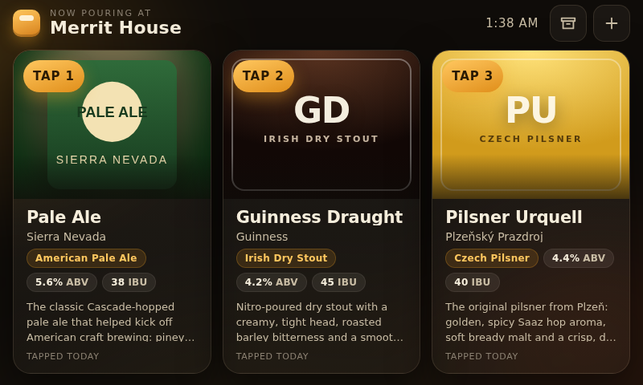
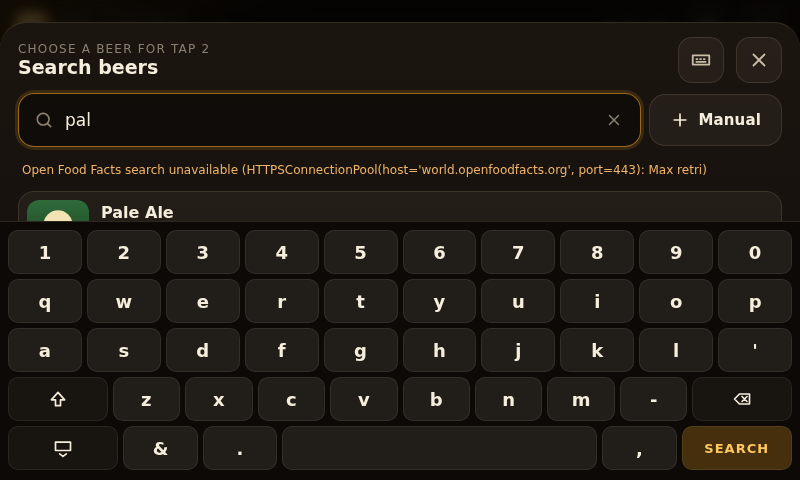

# Merrit House · On Tap

A touchscreen beer board for the kitchen kegerator. It runs on a Raspberry Pi 4
with the official 7" touchscreen and shows what's pouring on each tap, with label
art, style, ABV/IBU and a tasting note. Tap a beer to swap it, search for a new
one online, or kick the keg and send it to the archive.

Everything is one small Flask app plus a vanilla-JS front-end: no build step,
no accounts, no cloud. Your phone can open the same page over Wi-Fi to manage the
taps from the couch.





## Features

- **Board** – three big cards (configurable), label artwork with a blurred glow,
  style pill, ABV/IBU, description and how long it's been on tap. Live-updates
  when anything changes from another device.
- **Search** – type a beer, brewery or style. Results come from your own library
  first, then Open Food Facts (free, no key). Optional Untappd support if you
  have API credentials.
- **Labels** – artwork is downloaded and cached on the Pi so the board works
  offline. No label? A generated one is drawn in the beer's colour.
- **Edit anything** – name, brewery, style, ABV, IBU, description, and upload a
  photo of the can from your phone.
- **Archive** – kicked kegs land in the cellar with how many times they've been
  on and for how long. Re-tap them in two touches.
- **On-screen keyboard** – kiosk Chromium has no keyboard, so the app ships a
  touch one. Phones use their own; toggle with the keyboard icon.
- **Kiosk-ready** – systemd service, Chromium kiosk launcher, autostart entry,
  screen-blanking off. One install script.

## Try it on your laptop

```bash
git clone https://github.com/echang15/merrit-house.git
cd merrit-house
pip install -r requirements.txt
python3 app.py --demo        # seeds three sample beers on an empty board
```

Open <http://localhost:8080>. Resize the window to 800×480 to see the Pi layout.

## Install on the Raspberry Pi

Flash Raspberry Pi OS **with desktop** (Bullseye or Bookworm), connect the
touchscreen, get on Wi-Fi, then:

```bash
git clone https://github.com/echang15/merrit-house.git ~/merrit-house
cd ~/merrit-house
./install/install.sh
sudo reboot
```

The installer:

1. installs `python3-flask`, `python3-requests` and `chromium` via apt;
2. installs and starts `taplist.service` (the web app on port 8080, restarts on
   failure, starts on boot);
3. registers `install/kiosk.sh` to open Chromium full-screen when the desktop
   logs in (XDG autostart, plus labwc / wayfire autostart on Bookworm);
4. disables screen blanking with `raspi-config`.

After the reboot the board fills the screen. From any phone on the same network,
open `http://<pi-ip>:8080/` to manage it (the installer prints the address).

Useful commands:

```bash
sudo systemctl status taplist      # is the app up?
journalctl -u taplist -f           # logs
sudo systemctl restart taplist     # after editing the code or taplist.env
```

If the Pi is set to boot to the console instead of the desktop, enable desktop
autologin with `sudo raspi-config` → System Options → Boot / Auto Login.

## Configuration

Create `taplist.env` next to `app.py` (the service reads it) or export the
variables in your shell:

| Variable | Default | What it does |
|---|---|---|
| `TAPLIST_HOUSE` | `Merrit House` | Name shown at the top of the board |
| `TAPLIST_TAPS` | `3` | Number of taps |
| `TAPLIST_DATA` | `./data` | Where the SQLite database and cached labels live |
| `TAPLIST_PORT` | `8080` | Port to listen on |
| `TAPLIST_UNTAPPD_CLIENT_ID` / `TAPLIST_UNTAPPD_CLIENT_SECRET` | unset | Enables Untappd search (better descriptions and labels) |
| `TAPLIST_DISABLE_OFF` | unset | Set to `1` to turn off Open Food Facts search |
| `TAPLIST_SEARCH_TIMEOUT` | `8` | Seconds to wait for an online search |

**Fonts.** The UI uses the system font stack. Drop a `display.woff2` (or
`display.ttf`) into `taplist/static/fonts/` and the whole UI switches to it.

## How the pieces fit

```
app.py                    entry point / CLI (--port, --demo)
taplist/api.py            Flask app and JSON API
taplist/db.py             SQLite: beers, taps, tap_history
taplist/providers.py      Open Food Facts + Untappd search
taplist/labels.py         label download and upload storage
taplist/static/           index.html, style.css, app.js (the UI)
install/                  systemd unit, kiosk launcher, autostart, installer
tests/test_api.py         unit tests (python3 -m unittest discover -s tests)
```

### API

| Method | Path | Purpose |
|---|---|---|
| `GET` | `/api/state` | Taps with their beers, house name, version |
| `GET` | `/api/search?q=` | Library + online results |
| `POST` | `/api/taps/<n>` | `{beer_id}` or `{beer:{…}}` — put a beer on tap *n*, archiving the previous one |
| `DELETE` | `/api/taps/<n>` | Kick the keg on tap *n* |
| `GET` | `/api/archive` | Every beer not on tap, with pour history |
| `POST` | `/api/beers` | Create a beer |
| `PUT` | `/api/beers/<id>` | Edit a beer |
| `DELETE` | `/api/beers/<id>` | Remove a beer (not while it's on tap) |
| `POST` | `/api/beers/<id>/label` | Upload label artwork (multipart field `label`) |
| `GET` | `/api/history` | Chronological tap log |

Data lives in `data/taplist.db` and `data/labels/`; back those up and you have
everything.

## A note on beer data

Open Food Facts is community-maintained, so coverage skews toward supermarket
beers and descriptions are often just the ingredient list. Everything is
editable before it goes on the tap, and once a beer is in your library it's
found instantly without going online. Untappd's API has the best data but they
no longer hand out keys freely; if you already have one, drop it in `taplist.env`.
